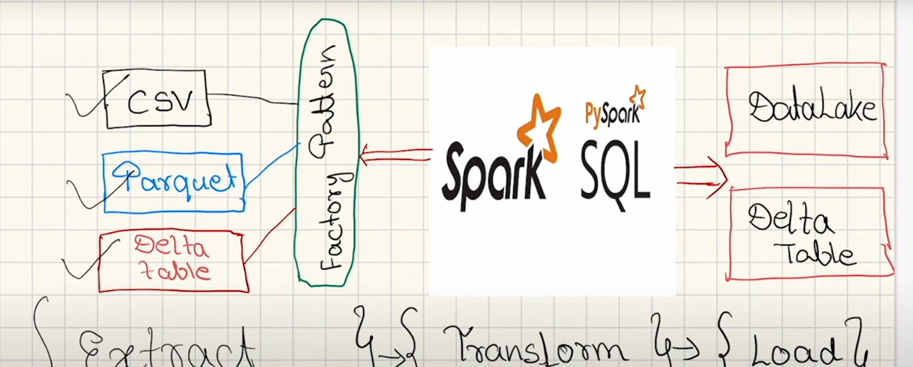
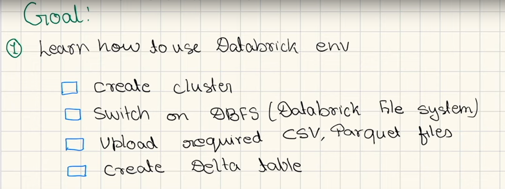
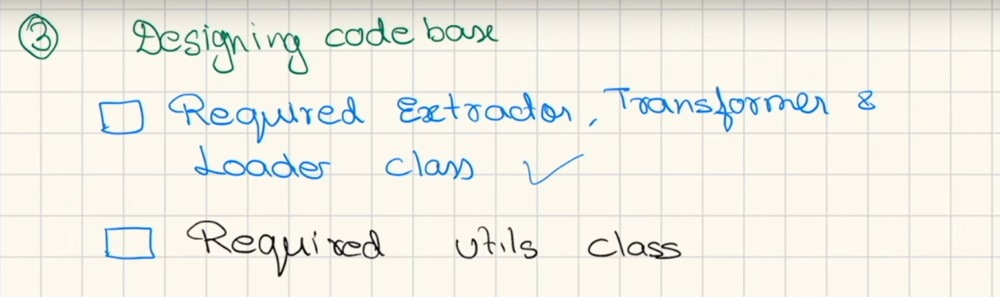
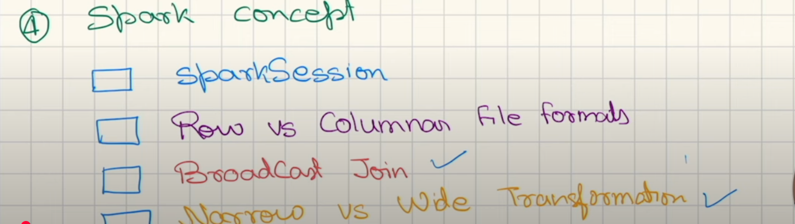
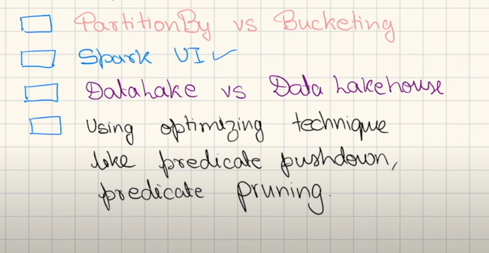

GOALS: 
STEP 1

STEP 2 

STEP 3

STEP 4 

JOB STAGE 8 TASK

PROJECT INTOR 

- customer who bought airpods after buying ipjone 

- customers who have bought both airpods and iphone 

- list all the products bought by customers after their initial purchase

- determine avg time delay buying an iphone 8 buying airpods for each cstomer

- identify the top 3 selling products in each category by total revenue 
